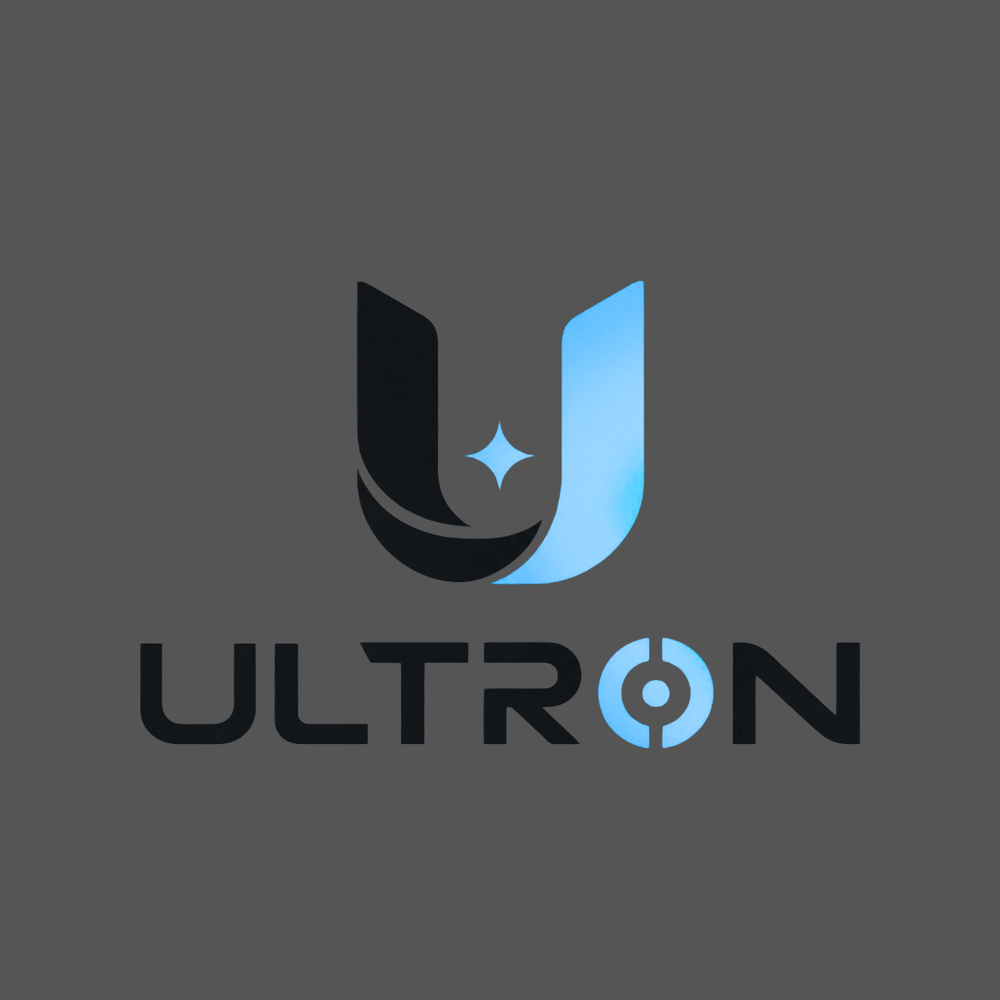

<p align="center">
  
</p>

<h1 align="center">ULTRON Agent</h1>

<p align="center">
  <strong>Your AI-Powered Desktop Assistant — Voice, Text & GUI</strong><br>
  <em>Made by 4 Bottle Codeka</em>
</p>

<p align="center">
  <a href="#-features">Features</a> •
  <a href="#-architecture">Architecture</a> •
  <a href="#-quick-start">Quick Start</a> •
  <a href="#%EF%B8%8F-usage">Usage</a> •
  <a href="#-configuration">Configuration</a> •
  <a href="#-skills">Skills</a> •
  <a href="#-contributing">Contributing</a>
</p>

<p align="center">
  
  
  
  
</p>

---
---

## 🏆 Samsung PRISM GenAI Hackathon 2026 — Theme 4: Streaming Live RAG

> **Team Name**: 4 Bottle Codeka  
> **College**: Thapar Institute of Engineering & Technology, Patiala  
> **Members**: Abhinav Kumar Singh (Lead), Sukhansh Mittal, Lakkshya Jha, Vikramaditya Singh  
> **Demo Video**: [https://youtu.be/L_8gDd7ju04](https://youtu.be/L_8gDd7ju04)  
> **Official Release Tag**: `PRISM_GENAI_HACKATHON_Y2026`  

### 📂 Official Submission Deliverables (`submission/`)
| Deliverable | Location | Description |
|---|---|---|
| **Presentation Deck (PPTX)** | [`submission/Thapar_4_Bottle_Codeka_Submission.pptx`](submission/Thapar_4_Bottle_Codeka_Submission.pptx) | Official 12-slide presentation with embedded architecture & telemetry HUD |
| **Presentation Deck (PDF)** | [`submission/Thapar_4_Bottle_Codeka_Submission.pdf`](submission/Thapar_4_Bottle_Codeka_Submission.pdf) | High-resolution PDF export following official nomenclature |
| **System Architecture Brief** | [`submission/SYSTEM_ARCHITECTURE_BRIEF.md`](submission/SYSTEM_ARCHITECTURE_BRIEF.md) | 6-page comprehensive technical design rationale, pipeline & telemetry |
| **Benchmarking Report** | [`submission/BENCHMARK_REPORT.md`](submission/BENCHMARK_REPORT.md) | Quantitative evaluation (G1–G9), edge-case analysis & 2 ablation studies |
| **Demo Video Walkthrough** | [YouTube Video](https://youtu.be/L_8gDd7ju04) & [`submission/DEMO_VIDEO.md`](submission/DEMO_VIDEO.md) | Full 9-scene video walkthrough breakdown and evaluator replay instructions |
| **Deliverables Checklist** | [`submission/CHECKLIST.md`](submission/CHECKLIST.md) | Official 8-point Engineering Deliverables verification |

### ⚡ Instant Verification & Reproduction Commands
```bash
# 1. Run all 10 Samsung PRISM Technical Evaluation Gates (G1–G9 + G0)
PYTHONPATH=. python3 streaming_rag/benchmark.py

# 2. Launch the 9-scene live broadcast demonstration (interactive or auto)
python3 run.py demo
# Or inside the interactive Cybernetic CLI:
python3 run.py --cli  # type /demo

# 3. Evaluate the 15 official questions against the 21-section master policy.pdf
PYTHONPATH=. python3 scripts/test_policy_questions.py

# 4. Run automated test suite (11/11 tests green)
pytest tests/test_streaming_rag.py -v

# 5. One-command containerized execution
docker compose up
```

### 📊 Benchmark Scorecard (All Gates Passed)
- **G1 Reproducibility**: Automated single-command pass (11/11 tests green).
- **G2 Early Retrieval Trigger**: **+1,300.0ms** time gain before sentence completion (Target >= 800ms).
- **G3 Multi-Intent Identification**: **3 orthogonal sub-queries** parallelized concurrently.
- **G4 Factual Grounding**: **100% exact section citations** (`[Doc_POLICY §XX]`), 0 hallucinated IDs.
- **G5 Session Refinement**: Incremental state lineage ($V_1 \to V_2$) with baseline preservation.
- **G6 Telemetry & Observability**: Complete end-to-end trace capture (latency, TTFT, token budgets).
- **G7 Context Discontinuity**: Cross-turn coreference & anaphora resolution (*"there"*, *"for 50 people"*).
- **G8 Intra-Stream Pivot**: Mid-speech self-correction (*"Pune... actually Mumbai"*) cache invalidation.
- **G9 TTFT & Token Yield**: **16.0ms TTFT** (Target < 50ms) with true incremental streaming yield.
- **G0 Presentation Suppression**: **0 corpus vector queries** executed on reformatting turns.

---

## 🧠 What is ULTRON?

**ULTRON** is a modular, open-source AI desktop assistant that combines voice interaction, LLM-powered intelligence, and an extensible skill system. Designed for high performance, local privacy, and speculative streaming RAG.

Built with a clean, layered architecture, ULTRON supports multiple interaction modes and can be extended with custom skills for any task you need.

---

## ✨ Features

| Category | Highlights |
|----------|-----------|
| 🎙️ **Voice Interaction** | Wake word detection (Porcupine / OpenWakeWord), push-to-talk, continuous listening |
| 🗣️ **Speech-to-Text** | Faster Whisper with Silero VAD for accurate, low-latency transcription |
| 🔊 **Text-to-Speech** | Piper TTS for natural, offline speech synthesis |
| 🤖 **LLM Intelligence** | NVIDIA NIM (cloud) or Ollama/Qwen (local) — switchable at runtime |
| 🧩 **Extensible Skills** | App launcher, web search, volume/brightness control, math, screenshots, and more |
| 🧠 **Persistent Memory** | Remembers facts about you across sessions (JSON-backed) |
| 🖥️ **Desktop GUI** | PyQt6 interface with async event loop (qasync) |
| ⌨️ **Text Mode** | Full terminal-based interaction — no microphone needed |
| 📡 **Event-Driven** | Async event bus architecture for clean, decoupled communication |

---

## 🏗 Architecture

```
┌──────────────────────────────────────────────────────────┐
│                     Entry Points                         │
│         main.py  •  run.py  •  main_gui.py               │
└────────────────────────┬─────────────────────────────────┘
                         │
┌────────────────────────▼─────────────────────────────────┐
│                  Core Orchestration                       │
│    Assistant  •  Orchestrator  •  EventBus  •  Container  │
│                    (core/)                                 │
└────────────────────────┬─────────────────────────────────┘
                         │
        ┌────────────────┼────────────────┐
        ▼                ▼                ▼
┌──────────────┐ ┌──────────────┐ ┌──────────────┐
│ Intelligence │ │     LLM      │ │    Skills    │
│  Intent  →   │ │ NVIDIA NIM   │ │ App Launcher │
│  Planner →   │ │ Ollama/Qwen  │ │ Web Search   │
│  Router      │ │ Mock (test)  │ │ System Ctrl  │
│              │ │              │ │ Memory       │
│(intelligence)│ │   (llm/)     │ │  (skills/)   │
└──────────────┘ └──────────────┘ └──────────────┘
        │
        ▼
┌──────────────────────────────────────────────────────────┐
│                    Infrastructure                         │
│  Speech I/O (speech/)  •  Memory (memory/)  •  UI (ui/)   │
│  Config (config/)  •  Utils (utils/)                      │
└──────────────────────────────────────────────────────────┘
```

**Pipeline flow:** Voice/Text Input → STT → Intent Detection → Planner → Skill Execution → TTS → Response

---

## 🚀 Quick Start

### Prerequisites

- **Python 3.13+**
- **uv** (recommended) or **pip**
- A microphone (for voice modes)
- An LLM provider:
  - [NVIDIA NIM API key](https://build.nvidia.com/) (cloud), or
  - [Ollama](https://ollama.com/) running locally (free)

### Windows (One-Click Setup)

```batch
:: Run setup — installs Python 3.13, uv, and all dependencies
setup.bat

:: Launch ULTRON
run_ultron.bat
```

### Linux / macOS

```bash
# Clone the repository
git clone https://github.com/MicrosoftStudentChapter/ultron.git
cd ultron

# Install with uv (recommended)
uv sync

# Or install with pip
pip install -e .

# Set up your environment
cp .env.example .env
# Edit .env with your API keys

# Run ULTRON
python main.py
```

### Cross-Platform Bootstrap Script

```bash
# Interactive setup with system dependency checks
python scripts/bootstrap.py

# Skip prompts (auto-yes)
python scripts/bootstrap.py --yes
```

---

## 🔄 Upgrading ULTRON

Keep your ULTRON agent up to date with upstream improvements, dependencies, and database migrations:

```bash
# Update repository, dependencies, and migrations from terminal
ultron upgrade

# Or run the upgrade command inside the interactive CLI session:
/upgrade
```

## ⌨️ Usage

ULTRON supports three interaction modes:

### Text Mode (default)

```bash
python run.py                 # or simply: python main.py
python run.py --mode text
```

Type your commands in the terminal. No microphone needed.

### Push-to-Talk Mode

```bash
python run.py --mode no-wake
```

Hold the configured key (default: `Right Shift`) to talk, release to process.

### Wake Word Mode

```bash
python run.py --mode wakeword
```

Say **"Hey Ultron"** (or your configured wake word) to activate, then speak your command.

### Continuous Voice Mode

```bash
python run.py --mode continuous
```
Or type `/continuous` in the text CLI. ULTRON will listen, respond, and immediately listen again without needing wake words or button presses. Press `Ctrl+C` to return to text mode.

### GUI Mode

```bash
python main_gui.py
```

Full PyQt6 desktop interface with visual feedback and controls.

---

## ⚙ Configuration

All configuration is done through environment variables in `.env`. Copy the example file to get started:

```bash
cp .env.example .env
```

### Key Settings

| Variable | Default | Description |
|----------|---------|-------------|
| `LLM_PROVIDER` | `nvidia` | LLM backend: `nvidia` or `qwen` |
| `NVIDIA_API_KEY` | — | Your NVIDIA NIM API key |
| `NVIDIA_MODEL` | `meta/llama-3.1-8b-instruct` | Cloud LLM model |
| `OLLAMA_BASE_URL` | `http://localhost:11434` | Local Ollama endpoint |
| `QWEN_MODEL` | `qwen3:4b-instruct` | Local Qwen model name |
| `STT_MODEL` | `base` | Whisper model size: `tiny.en`, `base`, `small`, `medium.en` |
| `STT_DEVICE` | `cpu` | Whisper device: `cpu` or `cuda` |
| `TTS_ENGINE` | `piper` | TTS engine: `piper` (local) or `pyttsx3` (offline) |
| `WAKEWORD_ENGINE` | `porcupine` | Wake word engine |
| `PICOVOICE_ACCESS_KEY` | — | Picovoice key (for Porcupine wake word) |
| `HOLD_TO_TALK_KEY` | `right_shift` | Key for push-to-talk mode |
| `SILENCE_TIMEOUT` | `1.0` | Seconds of silence before processing (lower = faster) |
| `LOG_LEVEL` | `INFO` | Logging verbosity |

See [`.env.example`](.env.example) for the full list.

---

## 🧩 Skills

ULTRON comes with a growing set of built-in skills:

| Skill | Description |
|-------|-------------|
| `ApplicationSkill` | Open/close/switch desktop applications |
| `BrowserSkill` | Open URLs and perform web navigation |
| `WebSkill` | Search the web via DuckDuckGo and summarize results |
| `ClockSkill` | Tell the current time and date |
| `MathSkill` | Evaluate mathematical expressions (powered by SymPy) |
| `VolumeSkill` | Control system volume (up/down/mute) |
| `BrightnessSkill` | Adjust screen brightness |
| `MicSkill` | Mute/unmute/toggle the microphone |
| `ScreenshotSkill` | Capture screenshots |
| `FolderSkill` | Navigate and manage folders |
| `WeatherSkill` | Get current weather information |
| `ChatSkill` | General conversation and Q&A |
| `MemorySkill` | Remember and recall personal facts |
| `DefaultSkill` | Fallback handler for unrecognized commands |

### Creating a Custom Skill

```python
from skills.base import Skill
from intelligence.task import Task


class MyCustomSkill(Skill):
    name = "MyCustomSkill"
    description = "Does something awesome."
    version = "1.0.0"
    enabled = True

    async def execute(self, task: Task) -> str:
        # Your logic here
        return "Done!"
```

Register it in the `SkillRegistry` and the intent router will dispatch to it automatically.

---

## 📁 Project Structure

```
ultron/
├── main.py                  # CLI entry point
├── main_gui.py              # GUI entry point (PyQt6)
├── run.py                   # Unified launcher (text / voice / wakeword)
├── pyproject.toml           # Project config & dependencies
├── .env.example             # Environment variable template
│
├── config/                  # Settings, constants, logging
│   ├── settings.py          #   Pydantic-based configuration
│   ├── constants.py         #   Application-wide constants
│   └── logging_config.py    #   Structured logging (Loguru + structlog)
│
├── core/                    # Application lifecycle & orchestration
│   ├── assistant.py         #   Top-level Assistant facade
│   ├── container.py         #   Dependency injection container
│   ├── event_bus.py         #   Async event pub/sub system
│   ├── orchestrator.py      #   Main pipeline coordinator
│   ├── state.py             #   State machine definitions
│   └── lifecycle.py         #   Application boot/shutdown
│
├── intelligence/            # NLU pipeline
│   ├── intent_detector.py   #   Intent classification (LLM-powered)
│   ├── planner.py           #   Task planning from intents
│   ├── router.py            #   Route tasks to skills
│   ├── parser.py            #   LLM response parsing
│   └── task.py              #   Task data model
│
├── llm/                     # LLM provider abstraction
│   ├── base.py              #   Abstract LLM interface
│   ├── nvidia.py            #   NVIDIA NIM implementation
│   ├── qwen.py              #   Ollama/Qwen implementation
│   ├── switcher.py          #   Runtime provider switching
│   ├── prompts.py           #   System & few-shot prompts
│   └── response.py          #   Typed response envelope
│
├── skills/                  # Extensible skill system
│   ├── base.py              #   Abstract Skill contract
│   ├── registry.py          #   Skill lookup registry
│   ├── manager.py           #   Lifecycle management
│   ├── system_skills.py     #   Desktop control skills
│   ├── web_skill.py         #   Web search & scraping
│   ├── chat_skill.py        #   Conversational AI
│   └── memory_skills.py     #   Memory recall/store
│
├── speech/                  # Audio I/O subsystem
│   ├── speechconfig.py      #   Audio configuration
│   ├── hold_to_talk.py      #   Push-to-talk controller
│   ├── speech_to_text/      #   STT pipeline
│   │   ├── transcriber.py   #     Faster Whisper transcription
│   │   ├── recorder.py      #     Audio capture with VAD
│   │   ├── stt_pipeline.py  #     End-to-end STT
│   │   └── vad.py           #     Silero Voice Activity Detection
│   ├── text_to_speech/      #   TTS pipeline
│   │   ├── speaker.py       #     Piper speech synthesis
│   │   ├── player.py        #     Audio output playback
│   │   └── tts_pipeline.py  #     End-to-end TTS
│   └── wake_word/           #   Wake word detection
│       └── detector.py      #     Porcupine / OpenWakeWord
│
├── memory/                  # Persistent context memory
│   ├── models.py            #   MemoryFact data model
│   ├── store.py             #   JSON-backed persistence
│   ├── extractor.py         #   Fact extraction from speech
│   └── service.py           #   Memory service facade
│
├── ui/                      # Desktop GUI
│   └── main_window.py       #   PyQt6 main window
│
├── utils/                   # Shared utilities
│   ├── exceptions.py        #   Custom exception hierarchy
│   ├── cli.py               #   Terminal UI helpers
│   ├── cache.py             #   LLM response caching
│   ├── decorators.py        #   Reusable decorators
│   ├── helpers.py           #   General utilities
│   └── validators.py        #   Input validation
│
├── tests/                   # Test suite (pytest)
├── docs/                    # Documentation
├── scripts/                 # Setup & bootstrap scripts
├── bootstrap/               # Windows bootstrapper
├── assets/                  # Static assets
└── logs/                    # Runtime logs (gitignored)
```

---

## 🧪 Running Tests

```bash
# Run all tests
pytest

# Run with verbose output
pytest -v

# Run a specific test module
pytest tests/test_core.py

# Run with coverage report
pytest --cov=. --cov-report=html
```

---

## 🛠 Development

### Tech Stack

| Layer | Technology |
|-------|-----------|
| Language | Python 3.13+ |
| Package Manager | [uv](https://docs.astral.sh/uv/) |
| Config | Pydantic Settings + python-dotenv |
| LLM | OpenAI-compatible API (NVIDIA NIM, Ollama) |
| STT | Faster Whisper + Silero VAD |
| TTS | Piper TTS |
| Wake Word | Porcupine + OpenWakeWord |
| GUI | PyQt6 + qasync |
| Logging | Loguru + structlog |
| Testing | pytest + pytest-asyncio |
| Linting | Ruff |
| Type Checking | mypy (strict) |

### Code Standards

- **PEP 8** compliance (enforced via Ruff)
- **Google-style docstrings** on all public APIs
- **Strict type hints** on every function signature
- Custom exceptions for all subsystem boundaries

---

## 🗺 Roadmap

- [x] **Phase 0** — Project scaffold, module signatures, DI container
- [x] **Phase 1** — Core voice pipeline (STT, TTS, Orchestrator)
- [x] **Phase 2** — Extensible skill system, desktop control skills
- [ ] **Phase 3** — Custom ONNX wake word models, vector memory, multi-step planning

---

## 🤝 Contributing

Contributions are welcome! Here's how to get started:

1. **Fork** the repository
2. **Create a branch** for your feature: `git checkout -b feature/my-feature`
3. **Make your changes** following the code standards above
4. **Run the tests**: `pytest`
5. **Submit a Pull Request**

### Team Structure

| Team | Scope |
|------|-------|
| Core Platform | `core/`, `config/`, `utils/` |
| Speech | `speech/` |
| LLM | `llm/` |
| Intelligence | `intelligence/` |
| Skills | `skills/` |

---

## 📄 License

This project is licensed under the **MIT License** — see the [LICENSE](LICENSE) file for details.

---

